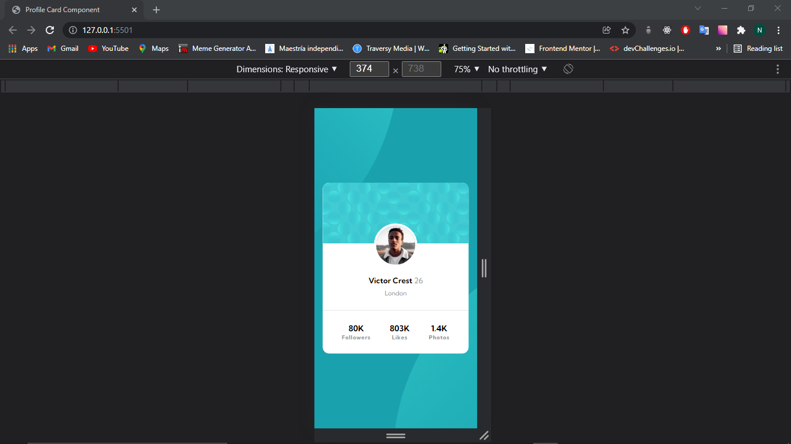

# Profile card component solution

Solucion a [Profile card component challenge on Frontend Mentor](https://www.frontendmentor.io/challenges/profile-card-component-cfArpWshJ). 

## TABLA DE CONTENIDOS

- [Profile card component solution](#profile-card-component-solution)
  - [TABLA DE CONTENIDOS](#tabla-de-contenidos)
  - [INFORMACION GENERAL](#informacion-general)
    - [DESAFIO](#desafio)
    - [Screenshot](#screenshot)
    - [Links](#links)
    - [CONSTRUIDO CON...](#construido-con)
  - [Author](#author)

## INFORMACION GENERAL

### DESAFIO

Los usuarios deben ser capaces de:

- Ver el diseño óptimo según el tamaño de pantalla de su dispositivo

### Screenshot

### Links

- Solucion URL: [https://github.com/NicolasGula/Profile-card-component](https://github.com/NicolasGula/Profile-card-component)
- URL del sitio: [https://nicolasgula.github.io/Profile-card-component/](https://nicolasgula.github.io/Profile-card-component/)

### CONSTRUIDO CON...

- HTML5 
- CSS , SASS
- Flexbox
- Mobile-first workflow

## Author

- Website - [Nicolas Gula](https://www.your-site.com)
- Twitter - [@nicolas_gula](https://twitter.com/nicolas_gula)

